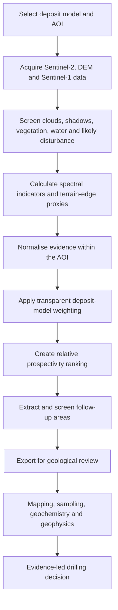

# GeoMiner: Turning Earth Observation Into Transparent Exploration Follow-up Areas

*An early-stage exploration decision-support platform.*

Mineral exploration decisions are rarely made from a single map. Geologists combine alteration, structure, topography, field observations, geochemistry and deposit-model knowledge, then test the resulting hypotheses. GeoMiner is a workbench I am building to make the remote-sensing part of that process faster, more traceable and easier to discuss.

## What GeoMiner does

GeoMiner brings Sentinel-2 surface reflectance, a digital elevation model and Sentinel-1 backscatter into one map-based exploration workflow. An explorer selects a deposit model, defines an area of interest and reviews the individual evidence layers before generating ranked follow-up areas.

The current deposit-model presets cover porphyry Cu–Au, epithermal Au–Ag, lithium-caesium-tantalum pegmatites, iron oxide/gossans and VMS base metals. Each preset exposes its weighting of alteration indicators, iron-oxide/gossan indicators, terrain-edge density and directional-edge crossings. The application exports GeoJSON and CSV so the output can continue into QGIS, ArcGIS or a team’s normal interpretation workflow.

## How the workflow moves from imagery to follow-up

## The geological idea behind the workflow

Sentinel-2 provides broad multispectral evidence rather than direct mineral identification. GeoMiner calculates ratios that can help highlight hydroxyl-bearing alteration, ferric iron, ferrous/propylitic-style responses and oxidised surfaces. Cloud/shadow, vegetation and water/tailings screens reduce some common false responses. Terrain-derived edge layers add spatial context that can help an interpreter review possible structural corridors. Sentinel-1 is currently retained as a surface-roughness diagnostic and is not yet fused into the ranking model.

The layers are normalised within the selected area of interest and combined as a multi-criteria ranking. This is deliberately an exploration hypothesis tool: a high score means that several selected remote-sensing indicators coincide relative to the same AOI. It does **not** mean that the area has a measured probability of economic mineralisation.

## A more honest path from pixels to a prospect

There is a tempting but dangerous leap between an attractive satellite anomaly and a drill collar. GeoMiner is designed to make the intermediate work visible. A ranked area should be checked against published geology and known mineral occurrences, then followed by field mapping, lithological and alteration observations, geochemistry and, where appropriate, geophysics. Only that converging evidence can justify a drill decision.

The tool makes several limits explicit:

- Sentinel-2 SWIR data are 20 m pixels, so map boundaries are screening footprints, not surveyed geological contacts.
- Terrain-edge and directional-crossing layers are structural proxies. Roads, benches, lithological boundaries and erosion can create the same patterns; mapped faults must be independently verified.
- Scores are relative to the AOI and the selected deposit model. They are not calibrated probabilities, grades, resources or reserve statements.
- Mine-disturbance masking is a screening aid, not a substitute for imagery review or land-access checks. Candidate areas with substantial classified disturbance overlap are excluded, but false negatives remain possible.

## Current status

GeoMiner is an early-stage, unvalidated exploration-screening platform. It has a documented spatial validation protocol and a public Kazakhstan porphyry-copper baseline in development, but it does not yet have published independent benchmark results. Its outputs should therefore be treated as geological hypotheses for follow-up, not as predictions of mineralisation.

## What I am improving next

The next scientific priority is validation. I plan to test each deposit-model workflow against independent known occurrences and background sites, report recall at practical search-area limits, precision-recall performance and spatial leave-one-district-out validation, and calibrate any probability-like language only after that evidence exists. Other planned improvements include scene-specific illumination correction, published geology and lithology inputs, mapped faults, geochemical and geophysical evidence, and explicit data-quality/provenance reporting.

## Why build it

The aim is not to automate the geologist out of exploration. It is to provide a disciplined, visual way to move from regional remote sensing to a smaller, auditable set of field questions. If GeoMiner helps a team reject a false anomaly earlier, compare competing exploration hypotheses clearly, or decide where mapping and sampling will be most informative, it is doing its job.

*GeoMiner is an early-stage exploration decision-support tool. It is not investment advice, a resource estimate, or a substitute for qualified geological interpretation.*
